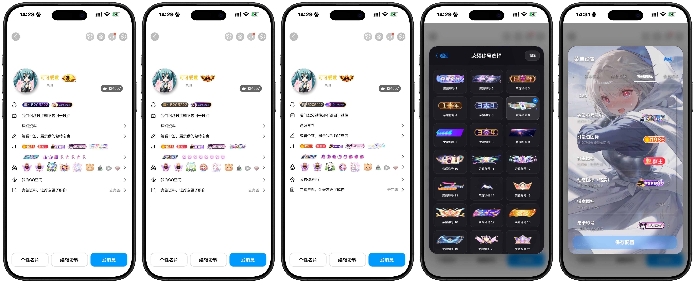

# QQ Emulator

> 被扒多了，索性直接开源。

这是项目的最终版本，后续不再更新。

本质上只是一个纯前端 HTML 项目。

最初是觉得好玩，后来一点点做起来，最后就成了现在的样子。

留着娱乐娱乐，偶尔装装 X，也挺好。

---

### 官网

https://xn--tlq395o.top/

### 官方交流群

https://qm.qq.com/q/R8q8Nt43aS

### 下载

高速下载：

https://1824159421.share.123pan.cn/123pan/EmjGjv-nqi8H?pwd=UUTb#

GitHub 源码：

https://github.com/GuYiovo/QQ-emulator/archive/refs/heads/main.zip

---

### Preview

---

### About

项目没有复杂的后端逻辑，核心内容均为前端实现。

现在公开源码，并不是准备继续维护，恰恰相反：

**这就是最终版本。**

以后不会再更新。

拿去看看、改改、玩玩，都可以。

---

### Disclaimer

本项目仅供学习、交流及个人娱乐使用。

本项目为个人制作的纯前端 HTML 项目，与腾讯、QQ 官方及其关联公司、组织或其他相关主体不存在任何隶属、代理、授权、合作或商业关系。

项目中涉及的名称、商标、Logo、图标、界面元素及其他相关内容，其相关权利归原权利人所有。本项目不主张对上述第三方内容享有任何权利。

未经授权，请勿利用本项目从事任何违法、违规、欺诈、冒充、恶意传播或侵犯他人合法权益的行为。

使用者应自行判断并承担使用、修改、复制、传播、部署及二次开发本项目所产生的一切风险与责任。因使用本项目或基于本项目产生的任何直接或间接损失、纠纷及法律责任，由实际使用者自行承担。

本项目已经公开源码，并确定为最终版本。后续不再承诺持续更新、维护、修复兼容性问题或提供技术支持。由于浏览器、操作系统、运行环境、第三方服务或其他外部因素发生变化而导致的异常，项目作者不作任何持续可用性的保证。

任何基于本项目进行的修改、二次开发、重新发布或衍生项目，均应遵守适用的法律法规、平台规则及相关第三方授权条款。

如本项目中存在涉及第三方合法权益的内容，相关权利人可联系项目作者进行反馈，项目作者将在合理范围内进行处理。

下载、使用、修改或传播本项目，即视为已阅读、理解并接受上述免责声明。

---

  Made for fun.

